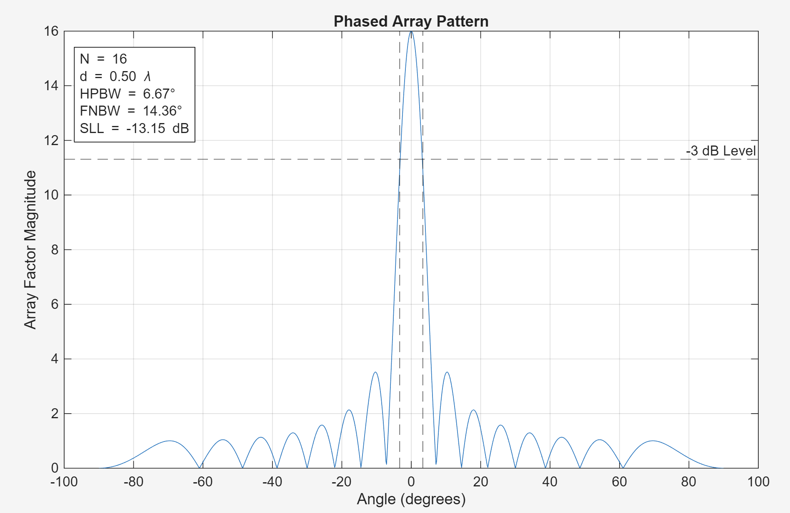
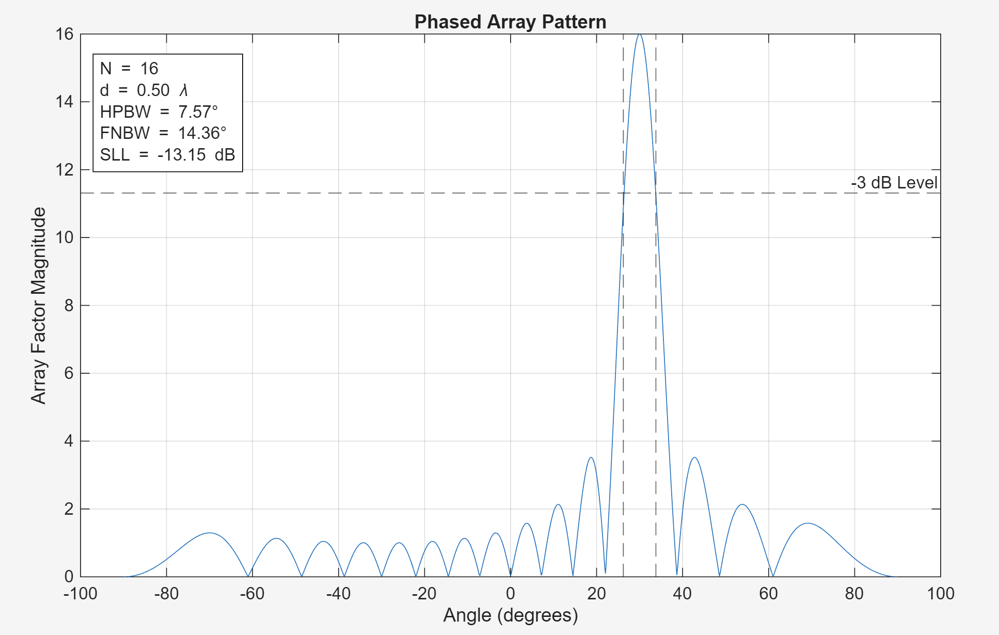
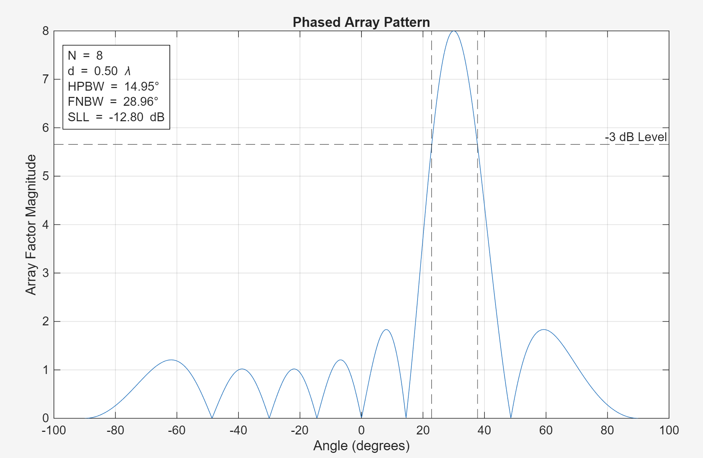
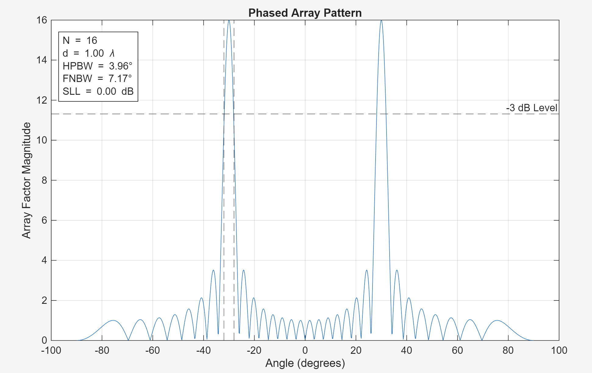

# Phased Array Antenna Simulation (MATLAB)

## Overview
This repository contains a MATLAB-based simulation of a **uniform linear phased array antenna**, developed from first principles using the analytical **array factor formulation**. The project focuses on electronic beam steering and quantitative evaluation of radiation pattern performance metrics.

The goal of this project is to build a clear theoretical and practical foundation in phased array behavior while producing clean, extensible simulation code suitable for further research, coursework, or hardware-oriented extensions.

---

## Key Features
- Electronic beam steering via progressive phase shift  
- Radiation pattern visualization (linear, normalized, and dB scales)  
- Analysis of grating lobe formation as a function of element spacing  
- Automated computation of core antenna performance metrics:
  - **Half-Power Beamwidth (HPBW)**
  - **First-Null Beamwidth (FNBW)**
  - **Sidelobe Level (SLL)** (linear and dB)
- Annotated plots for clear interpretation of results  
- Export of performance metrics to structured tables and CSV files  

---

## Performance Metrics
The simulation extracts standard phased array performance parameters directly from the computed array factor:

- **Half-Power Beamwidth (HPBW)**  
  Angular width of the main lobe measured at the −3 dB (0.707× peak) level.

- **First-Null Beamwidth (FNBW)**  
  Angular separation between the first nulls surrounding the main beam.

- **Sidelobe Level (SLL)**  
  Ratio of the highest sidelobe magnitude to the main beam peak, reported in both linear scale and decibels (dB).

All metrics are computed programmatically and stored for reuse in visualization, parameter sweeps, or future optimization studies.

---

## Concepts Explored
- Array factor theory and superposition of radiating elements  
- Constructive and destructive interference in phased arrays  
- Beam steering through phase progression  
- Effects of element spacing and array size on beamwidth and sidelobes  
- Practical limitations such as grating lobes and scan behavior  

---

## Adjustable Parameters
The simulation allows direct modification of key array parameters:
- Number of elements (`N`)
- Element spacing (`d`)
- Operating wavelength (`λ`)
- Beam steering angle (`θ₀`)
- Plot configuration (raw, normalized, or dB scale)

These parameters enable exploration of fundamental design trade-offs in phased array systems.

---

## How to Run
1. Clone or download this repository.
2. Open `phased_array_simulation.m` in MATLAB.
3. Modify array and plotting parameters near the top of the script as desired.
4. Run the script.

The simulation generates annotated radiation pattern plots and outputs computed performance metrics to both the MATLAB workspace and a CSV file for further analysis.

---

## Example Output
The simulation produces:
- Radiation pattern plots versus angle (degrees)
- Visual indicators for HPBW and −3 dB reference levels
- Computed performance metrics displayed in tables and saved for reuse

This structure makes the results suitable for reports, presentations, and future extensions.

---

## Future Work
Planned extensions include:
- Amplitude weighting (Taylor and Chebyshev tapers)
- Quantitative sidelobe suppression vs. beamwidth trade-off analysis
- Phase quantization and hardware-aware beam steering models
- Parameter sweeps and automated comparison plots
- Real-time parameter control using MATLAB UI sliders
- Hardware-oriented extensions toward phased array implementation

---

## Motivation
This project was developed to strengthen practical understanding of phased array antennas by bridging electromagnetic theory with simulation-based analysis techniques used in RF and antenna engineering.

---

## Example Radiation Patterns
The figures below demonstrate key phased array behaviors explored in this project.

### Broadside Array Pattern

### Beam Steering Example

### Beamwidth Variation with Number of Elements

### Grating Lobe Formation with Increased Element Spacing

